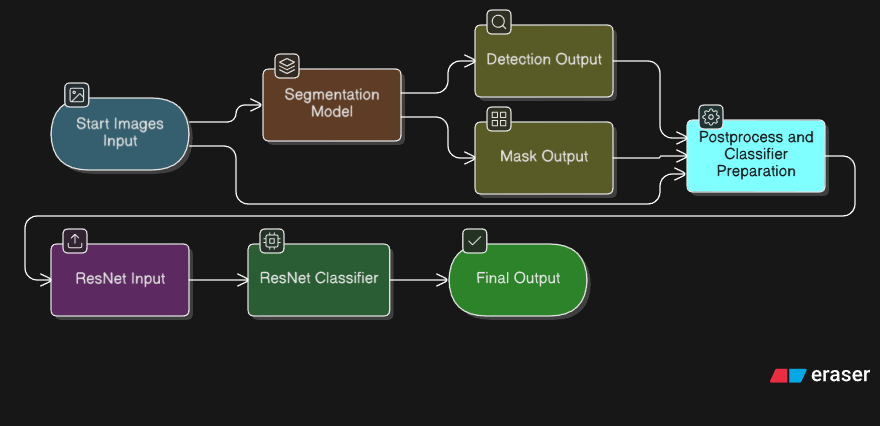

# 🍃 Leaf Disease Classification using Triton Inference Server and XAI



This project demonstrates an end-to-end workflow for segmenting and classifying plant leaf diseases using a YOLOv8 segmentation model, ResNet-50 classifier, and NVIDIA Triton Inference Server. The entire pipeline is production-ready and simulates real-world conditions where leaves need to be segmented before classification due to non-uniform backgrounds.

## 📚 Table of Contents

- [🔍 Motivation](#-motivation)
- [📦 Environment Setup](#-environment-setup)
- [🧪 Dataset](#-dataset)
- [🧩 YOLOv8 Segmentation (Ultralytics)](#-yolov8-segmentation-ultralytics)
- [🧪 TensorRT Conversion (inside Tritonserver Docker)](#-tensorrt-conversion-inside-tritonserver-docker)
- [📊 Embedding Visualization & Pipeline Planning](#-embedding-visualization--pipeline-planning)
- [🧪 Classification with ResNet-50](#-classification-with-resnet-50)
- [🚀 Triton Inference Server](#-triton-inference-server)
- [🎥 Inference Demo](#-inference-demo)

---

## 🔍 Motivation

In real-world settings, images are rarely perfectly cropped or clean. Instead of training directly on well-cropped images, we simulate deployment-like conditions by segmenting leaves from complex backgrounds first. This improves generalization and model focus, as supported by Grad-CAM visualizations.

<table>
  <tr>
    <td align="center">
      <a href="https://github.com/TejasARathod/AgriDoc-PlantDiseaseClassification-Triton/blob/f924f386bdbbe744be9af77b46c14d564a99ee30/Original_Grid.jpg" target="_blank">
        
      </a>
      <br/>
      <b>Original vs Segmented Images</b>
    </td>
    <td align="center">
      <a href="https://github.com/TejasARathod/AgriDoc-PlantDiseaseClassification-Triton/blob/f924f386bdbbe744be9af77b46c14d564a99ee30/GradCam_Grid.jpg" target="_blank">
        
      </a>
      <br/>
      <b>GradCam on Original vs Segmented Images</b>
    </td>
  </tr>
</table>

---

## 📦 Environment Setup

**Python setup** (for yolo training, preprocessing, data sorting and visualization):

```bash
python3 -m venv venv
source venv/bin/activate
pip install -r requirements.txt
```

**Deployment and Training**:

- Deployment: `nvcr.io/nvidia/tritonserver:23.10-py3`
- Classification Training: `nvcr.io/nvidia/pytorch:23.10-py3`

---

## 🧪 Dataset

**Source:** [PlantVillage Dataset](https://data.mendeley.com/datasets/tywbtsjrjv/1)

> Arun Pandian & G. Geetharamani, Mendeley Data, 2019  
> DOI: [10.17632/tywbtsjrjv.1](https://doi.org/10.17632/tywbtsjrjv.1)

- The dataset was annotated using [Roboflow](https://roboflow.com/) to facilitate YOLOv8-based segmentation.

- A segmentation pipeline was established to generate cropped leaf images with backgrounds removed. This preprocessing step ensured that the ResNet model was trained on input data representative of the images it would encounter during inference, thereby improving classification performance.

- The classification task focused exclusively on Apple leaf diseases, specifically Black Rot, Healthy, and Scab categories.


## 🧩 YOLOv8 Segmentation (Ultralytics)

Install Ultralytics:

```bash
pip3 install ultralytics
```

Train segmentation model:

```bash
yolo segment train data=data.yaml model=yolov8s-seg.yaml epochs=40 imgsz=640
```

Export to ONNX-TensorRT:

```bash
yolo export model=best.pt format=onnx_trt
```

## 🧪 TensorRT Conversion (inside Tritonserver Docker)

```bash
trtexec \
  --onnx=yolo_best.onnx \
  --minShapes=input:1x3x640x640 \
  --optShapes=input:15x3x640x640 \
  --maxShapes=input:30x3x640x640 \
  --fp16 \
  --workspace=4096 \
  --saveEngine=model.plan
```

> ⚠️ **Tip:** Use [Netron](https://netron.app/) to verify input layer names before conversion.

---

## 📊 Embedding Visualization & Pipeline Planning

Before training the ResNet-50 model for classification, it was essential to validate whether the selected architecture could effectively distinguish between the classes. To do this, I utilized the [FiftyOne](https://voxel51.com/fiftyone/) visualization tool to inspect feature embeddings generated by a pretrained ResNet-50 model.

- 🔹 Script: `fiftyone_embeddings.py`
- 🔹 Output: 

The resulting visualization confirmed that ResNet-50 was able to cluster the Apple leaf disease classes—Black Rot, Healthy, and Scab—with clear separation, providing confidence in its suitability for the classification task.

---

To just retain crops for training, the `model_repository` directory can be restructured to run a streamlined YOLOv8 segmentation pipeline:

- Retain only the following models:
  - `segmentation` (YOLOv8 TensorRT engine)
  - `postprocess_classifier` (Python backend for cropping and preprocessing)
- Remove:
  - `ensemble`
  - `resnet_classifier` (if not needed for classification postprocessing)

Update `client.py` accordingly to match this simplified workflow.

---

## 🧪 Classification with ResNet-50

Used [`NVIDIA DeepLearningExamples`](https://github.com/NVIDIA/DeepLearningExamples)  
Path: `PyTorch/Classification/ConvNets`

### 📁 Data Format

```
train/
 ├── 0/  (Black Rot)
 ├── 1/  (Healthy)
 └── 2/  (Scab)

val/
 ├── 0/
 ├── 1/
 └── 2/
```

### 🏋️ Training

```bash
python3 main.py /home/genai/Dataset \
  --arch resnet50 \
  --epochs 50 \
  --batch-size 4 \
  --lr 0.01 \
  --training-only \
  --num_classes 3 \
  --data-backend pytorch \
  --workspace checkpoints \
  --raport-file experiment_raport.json \
  --print-freq 1
```

### 🧪 Evaluation & Export

```bash
python3 classify.py --arch resnet50 \
  --pretrained-from-file resnet50_inference_weights.pth \
  --image Blackrot.png --num_classes 3
```

```bash
python3 model2onnx.py --arch resnet50 \
  --device cuda --image-size 224 \
  --batch-size 1 \
  --output resnet50_dynamic.onnx \
  --pretrained-from-file resnet50_inference_weights.pth \
  --num-classes 3
```
 
> ⚠️ **Note:** The DeepLearning Examples classify and model2onnx scripts work according to their shown example. Thus these scripts have been modified to suit [custom training]( https://github.com/TejasARathod/AgriDoc-PlantDiseaseClassification-Triton/tree/f924f386bdbbe744be9af77b46c14d564a99ee30/resnet_training) .

---


## 🚀 Triton Inference Server

Run Triton server:

```bash
tritonserver --model-repository=./model_repository/
```

Required dependencies (install inside Tritonserver Docker to start the server):

```bash
apt-get update && apt-get install ffmpeg libsm6 libxext6 -y
pip install opencv-python
```
## 🎥 Inference Demo

For a visual walkthrough of the complete inference pipeline—from segmentation to classification—refer to the following demo:


This animation demonstrates the model's ability to:

1. Accept an image input.
2. Perform YOLOv8-based segmentation to isolate the leaf region.
3. Process the segmented crop through a ResNet-50 classifier.
4. Return the final predicted disease label.

It illustrates the practical utility of deploying a multi-stage pipeline using Triton Inference Server in a modular and scalable fashion.


